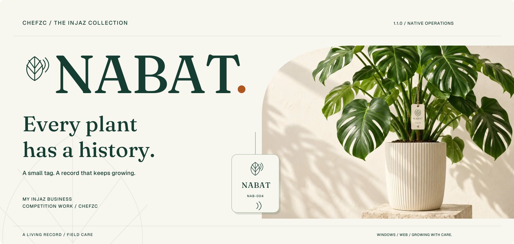
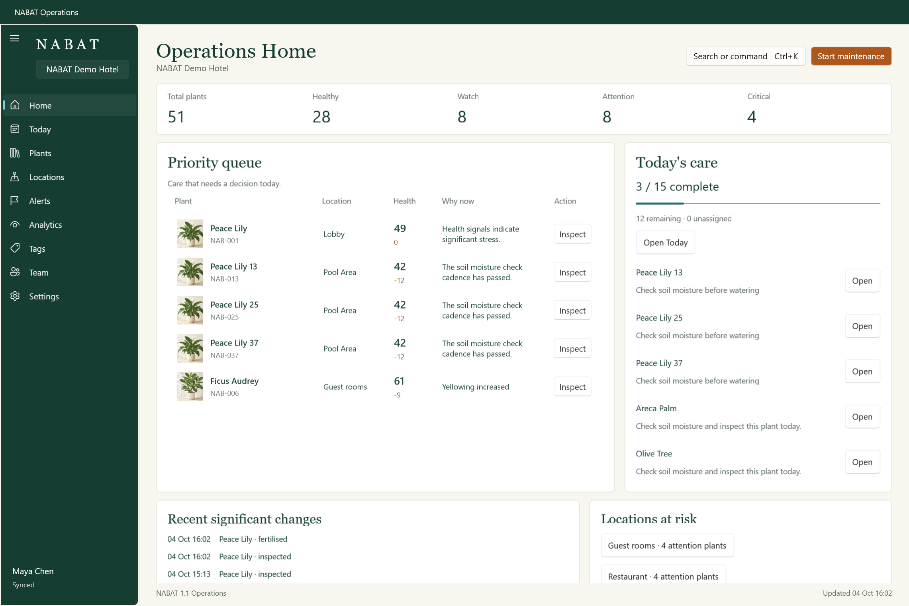
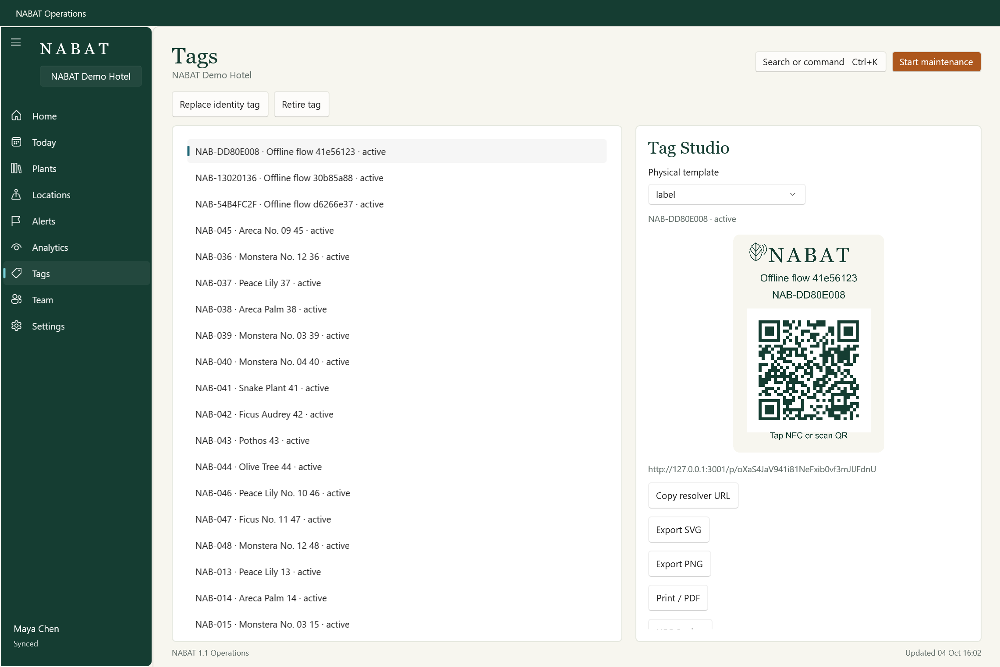
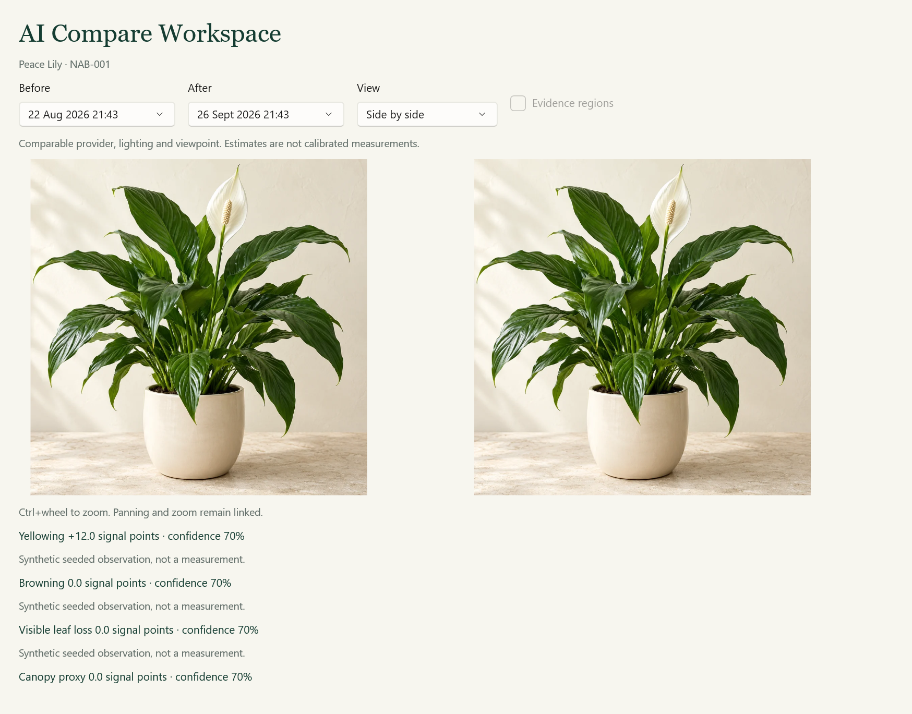

<a href="https://nabat-injaz.vercel.app/"></a>

<p align="center"><a href="README.md">English</a> · <b>简体中文</b></p>
<p align="center"><a href="https://nabat-injaz.vercel.app/"><b>进入 NABAT ↗</b></a> · <a href="https://chefzc.dev/school-gallery.html#project-nabat">生长档案展柜 ↗</a> · <a href="docs/OPERATIONS.md">工作台指南</a> · <a href="https://chefzc.dev/post.html?article=nabat">植物手记 ↗</a></p>

# NABAT · 让每一株，都被记得。

**这是我的 INJAZ 商赛作品。** 一枚小小的 NFC / QR 标签，把植物的身份、观察、照护与之后的历史连在一起。**1.1.0 / Operations / 试点版。** 现场的移动端与原生 Windows 工作台，围绕同一个经过授权的植物档案工作。

象牙白、深植物绿、叶绿素色与一点藏红花色。编辑式字形与精确的观察仪表，让一株植物始终留在故事中央。

## 01 / 一本会生长的档案

| 工作区           | 可以做什么                                                           |
| :--------------- | :------------------------------------------------------------------- |
| **植物身份**     | 稳定的 NFC / QR 入口、安全的公开身份页、标签替换与持续历史。         |
| **现场照护**     | 照片、观察和照护记录；已打开并登录的移动页面断网后可保留待同步照护。 |
| **原生 Windows** | WinUI 3 照护首页、今日任务、养护会话、虚拟化植物目录与独立档案窗口。 |
| **影像与证据**   | 联动的照片对照、真实时间的记录与分析来源；没有提供的证据不会被补画。 |
| **地点与协作**   | 地点平面图、植物位置、经过审查的批量操作、团队任务与历史交接。       |
| **标签工坊**     | 可打印 QR 设计与 NFC 编程模拟；物理写入及读回属于独立硬件验证。      |
| **本机连续性**   | 按身份隔离的 SQLite 缓存与持久照护队列；重试、回执与冲突清楚可见。   |



<details><summary><b>标签工坊 / Tag Studio</b></summary>



</details>

<details><summary><b>观察对照 / Observation comparison</b></summary>



</details>

以上为实际运行的 WinUI XAML 内容截图，不包含操作系统窗口框。植物品牌图与演示观察为**合成样例**，不是实际植物测量。封面沿用原有 NABAT 植物样图与字体，是可编辑的品牌插画。

## 02 / 开始一座植物收藏

**[公开网站](https://nabat-injaz.vercel.app/)** 可以直接浏览品牌介绍。注册或登录后使用个人植物工作区；照片保持私密，公开身份页只展示明确允许的字段。

本地演示建议使用 Node.js 22.23 或更新版本：

```powershell
npm ci
npm run dev:operations
```

打开 **http://127.0.0.1:3001**，选择 **Explore the demo**。脚本把合成数据库、储存与分析提供方和云端凭据隔离；演示中的照护和观察会保存在本机。

原生 Windows 构建位于 `windows/artifacts/`。请完整解压 x64 便携文件夹，不要只复制 EXE。`windows/Start-Nabat.ps1` 会启动隔离演示服务与原生应用；[构建与打包指南](docs/OPERATIONS_RELEASE.md)说明了自包含 x64 / ARM64 文件夹和未签名 MSIX 包。GitHub 发布完成后，再补上公开下载资产。

## 03 / 照护，也要保留来处

- 更换标签或经过授权的所属权交接，都保留植物身份与历史。
- 照片、照护先保存，分析可用性另行处理。提供方暂不可用时，不生成假分数。
- 前后对照需要相同的提供方、模型和契约，并说明观察质量、视角与光线。健康分数是启发式估计，不是经过校准的生物测量。
- 角色与权限保护各自的私密工作区；Windows 凭据由操作系统绑定，待同步工作保留原始记录者和所属空间。
- 本机连续性覆盖最近缓存的档案与照护重放；未缓存原图、新导入、全新离线启动私密网页属于其他边界。

既有 Workspace Agent 集成已经配置，但最近建立的外部触发失败为 HTTP 409；这里不宣称订阅推理服务已经恢复。物理 NFC 写入、可信签名安装、实体打印和 ARM64 真机执行仍待验证。

## 04 / 构建与验证

网页与共享 API：Next.js 16、React 19、TypeScript、PostgreSQL 和私密媒体储存。原生客户端：WinUI 3、Windows App SDK 2.5.1、.NET 10 与 SQLite。同一套领域 API，让植物身份与照护记录彼此接得上。

```powershell
npm test
npm run typecheck
npm run lint
npm run contract:check
npm run build
```

**2026.10.09**，既有 TypeScript 领域测试通过 **67 项**。[1.1 验收记录](docs/qa/operations/VERIFICATION.md)另行记录了 10 月 4 日的 25 项 C# 测试、8 项浏览器检查，以及发布后 x64 应用的原生渲染、真实进程重启和云端照护回执。这些已有记录不是新的实体硬件认证。

[架构说明](docs/ARCHITECTURE.md) · [工作台指南](docs/OPERATIONS.md) · [部署指南](docs/DEPLOYMENT.md) · [原始 V1 技术记录](docs/TECHNICAL-V1.md) · [资产来源](docs/design/ASSETS.md)

## 05 / INJAZ 商赛作品

**由 ChefZC 为 INJAZ 商赛制作。**

[校园展柜 ↗](https://chefzc.dev/school-gallery.html#project-nabat) · [Now 029 ↗](https://chefzc.dev/now.html#milestone-nabat) · [植物手记 ↗](https://chefzc.dev/post.html?article=nabat)

**小小的照护，也能长成持续的改变。— ChefZC**
