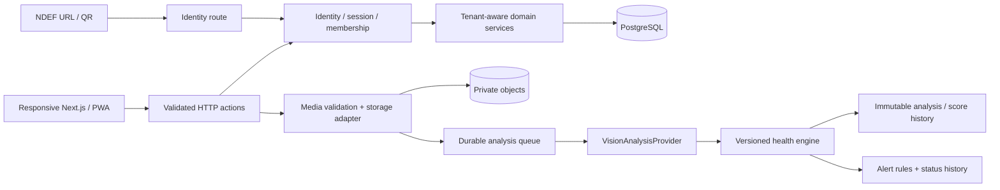

# Architecture

## Boundaries

Identity, Organisations, Plants, Care, Locations, Memberships, Tags, Alerts, Ownership, Analytics and Audit own separate `src/domain/*/service.ts` modules. Vision contracts/providers and the pure Health Engine are separate domains. `src/server/services.ts` is a stable facade for route/page consumers. Domain services own authorization and business transactions; React does not own those decisions. SQL, object storage, session/media signing, worker orchestration and observability are in server adapters.

## Relationships

Users have memberships with Owner/Admin/Manager/Caretaker roles. Organisations hold workspace kind/plan/timezone. Location hierarchy and plant location use tenant composite foreign keys. Plants have an internal UUID and a separate globally unique human code; a tag carries an independent random 192-bit token with lifecycle/replacement history.

Care events, photos, jobs, analyses, score snapshots, alerts, assignments and tags reference `(plant_id, organisation_id)` with update cascades. Acceptance of a plant transfer changes the parent tenant inside one locked transaction, carrying all plant-owned records. Transfers retain both source/destination workspace IDs, and organisation audits remain with their respective workspace. Plant history follows identity; old employee personal information is masked outside current memberships.

Sessions contain SHA-256 token hashes and expiry, not raw bearer tokens. Passwords use salted scrypt. Session cookies are HTTP-only, SameSite Lax and Secure in production. All mutating browser endpoints enforce the canonical origin, and inputs have server-side Zod validation. Account/IP and per-user database rate counters protect auth/API/upload paths. Parameterized SQL, tenant authorization and constraints work together. Runtime database access is server-only; PostgreSQL RLS is not configured in this V1.

## Care and capture

A one-tap care action generates a UUID idempotency key before saving. Retry does not duplicate the event or score. Current care can be enriched by its original actor for ten minutes, retaining an audit of previous details. Movement preserves readable location context. Photos can link to the source care event. The server records actor/time; callers cannot spoof the performer.

Upload signing creates a five-minute reservation tied to actor/plant. A single claim avoids repeated observation/job creation. Notes remain in the database, not in the signed URL. Bytes are bounded and validated by sharp (JPEG/PNG/WebP, still image, 40M pixel ceiling). Originals are retained, safe WebP derivatives are re-encoded, thumbnails are generated and only validated objects become observations. Storage can leave orphan objects after a process fails before DB commit; lifecycle cleanup is a documented operational responsibility.

Read links expire after five minutes, are HMAC-signed and tenant-bound. Responses use private/no-store. Public passports expose no media links. Storage keys are random under workspace/plant/photo paths, never arbitrary filesystem paths from callers.

## Analysis lifecycle

The observation and queued job are committed together. Claim increments attempts and sets a processing lease. The provider operates outside long database transactions. Completion validates the lease and locks the plant, then atomically writes the analysis, comparison, score composition/reasons and new alerts before completing the job. Unique photo-analysis and active alert-rule indexes prevent duplicate records. Committed visual analyses are never rewritten by an API. A transfer can update their access tenant; it does not alter evidence.

Current-state features and temporal comparison are distinct. A quality/comparability/viewpoint/provider/time gate selects up to three previous observations. Heuristic confidence grows with usable history, and low-quality or sparse observations stay in baseline state. Scores persist their engine version and component contributions. Engine/provider changes establish a fresh score comparison boundary. Signal confidence is a model estimate, not calibration proof.

Local development uses one process with PGlite and an internal bounded worker loop. Production uses a PostgreSQL pool and one or more separate workers with `SKIP LOCKED`. Expired final leases become failed jobs; failures have safe diagnostic messages and retry metadata. A scheduler can invoke a secret-authenticated worker endpoint. Alert state changes and ownership-sensitive operations produce audit events.

The deployed persistence adapters are Neon PostgreSQL and private Vercel Blob. In the selected subscription-only mode, Vercel does not invoke AI: an authorized local worker uses ChatGPT plan OAuth with GPT-6.1 Sol, scoped SQL claims and a stable host identity. DPAPI protects credentials on Windows; state/PKCE/nonce/JWT checks precede inference. OAuth tokens never enter Vercel or the web client. Account eligibility and live inference remain separate evidence boundaries; see `CHATGPT_SUBSCRIPTION.md` and the verification ledger.

## Product and extension contracts

The responsive shell, shared vitality/plant/timeline/dialog components and central tokens span marketing and the app. Profile identity is server-rendered; expensive observation evidence is progressively disclosed. Mobile fixed care controls make deep-linked care reachable immediately. Locale context and logical CSS keep RTL safe, with English as the full content locale. PWA caches only a static offline page, preventing stale private records or unconfirmed offline care.

Entitlements distinguish Personal/Pro/Business plant/team limits. Billing, sensor, notification and offline queue interfaces define future integration seams without presenting those services as connected. Sensor observations can use the observation source abstraction; future typed telemetry requires an additive migration and provider implementation. The current UI does not fabricate telemetry.

Observability has structured console events, request IDs, trace/error-monitor interfaces, job lifecycle diagnostics and React route error boundaries. No monitoring SaaS or notification transport has been connected.

## Next-stage roadmap

1. Complete subscribed inference evidence, pilot hardware matrix, optional S3/container verification, backup/restore rehearsal and calibrated plant dataset evaluation.
2. Complete Arabic editorial/species content, verified-email invitation acceptance and account recovery provider.
3. Entitlement/billing adapter, nursery transfer acceptance UX, assignment batches and audited CSV import/export.
4. Direct signed object upload for platform payload limits, orphan cleanup, queue throughput metrics and observation comparability UX.
5. Sensor/device schema and ingestion, notification adapters, offline idempotent queue/background sync.
6. Dedicated CV model evaluation with provenance, cohort comparisons and health-engine recalculation jobs that append new versions.
