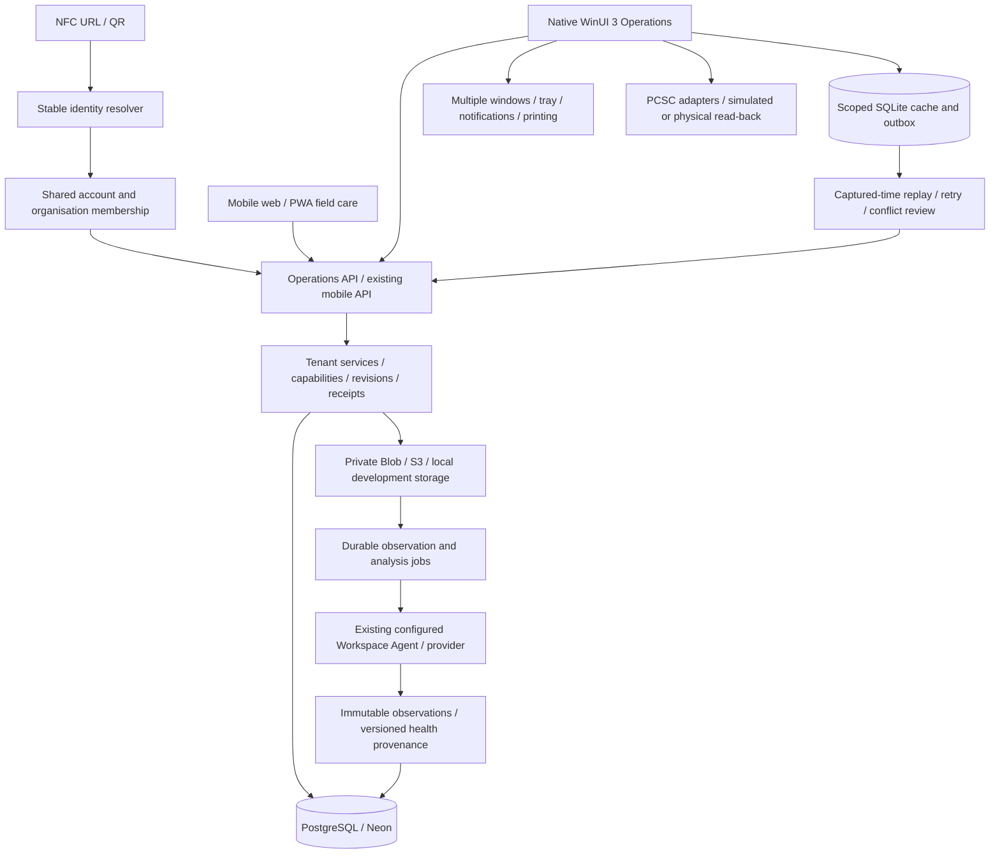

# NABAT 1.1 — Operations

NABAT combines stable NFC/QR plant identities, mobile field care and a native Windows operations workspace. Windows is built with WinUI 3, Windows App SDK 2.5.1 and .NET 10; it renders XAML controls and talks to the same versioned domain API as mobile. The 1.0 identity, organisation, authentication, private media and Workspace Agent foundations are retained.

## Run

```powershell
npm ci
npm run dev:operations
.\windows\Start-Nabat.ps1
```

Choose **Open local demo**. The isolated PGlite server listens at `http://127.0.0.1:3001`, starts with 48 synthetic plant identities and adds sample operational history/maps. Acceptance tests may add clearly named synthetic records. It masks cloud database, Blob/S3 and model credentials before Next loads local environment files. It never substitutes fixture results for cloud inference.

For cloud use, enter the permanent NABAT HTTPS origin and use an existing NABAT account. The shared deployment needs migrations 010–013 and the Operations API. Release status and exact evidence live in [release instructions](OPERATIONS_RELEASE.md) and [verification](qa/operations/VERIFICATION.md).

## Architecture



`Nabat.Core` isolates API transport, explicit snake_case DTOs, SQLite, sync, DPAPI, bounded image caching, deep links, NDEF/PCSC, pixel comparison, timeline coordinates and safe local telemetry. `Nabat.Windows` composes independent native workspaces around those services. The client never connects directly to SQL. Dependency injection provides local store, telemetry and notification services. Window contexts and bounds are stored separately from server-authoritative records.

## Shared API and security

Base: `/api/v1/operations`; contract: `operations/1.1`. [OpenAPI](contracts/operations.openapi.json) inventories 58 method/path definitions and generates eight central request/query schemas from runtime Zod definitions. `npm run contract:operations` regenerates it; `npm run contract:check` rejects drift. Remaining detailed mutation schemas live beside their domain services; C# response DTOs are explicitly mapped and verified against live API results, including PostgreSQL numeric strings.

Authentication reuses the existing seven-day opaque session. Windows receives a bearer session; web uses its HTTP-only cookie plus canonical-origin mutation checks. Membership and named capabilities enforce Owner, Admin, Manager, Caretaker and Viewer permissions on every private route. Viewer can read and save personal views but cannot log care, upload observations or manage the fleet. Care replay includes the capturing actor identity. UUID tenancy, member/location validation, bounded bodies/uploads, rate limits, audited writes and private `no-store` responses are enforced by the backend.

No credentials enter the outbox. DPAPI binds credentials to the Windows account. Local SQLite is scoped but is not a separately encrypted database. Images use immutable media identities, server/account/workspace keys and a 100 MiB LRU budget; recent private images are cached in the background with bounded concurrency. Signing out closes child windows and removes the session credential; retained pending work remains scoped to its original account.

## Operations workflows

Home combines global fleet metrics with an explained priority queue, due work, recent care and location risk. Priority pagination and visible explanations use the same severity, health/decline confidence, overdue care, inspection, visual stress, critical-location and scheduled-work factors. Location/team aggregates cover the whole fleet rather than the loaded grid page.

Today executes scheduled/overdue/alert work and maintenance sessions. Managers may allocate a session to a teammate. Mobile and Windows care/photo facts update visits and matching work in the same transaction. Session summaries derive counts from persisted events; completion waits for local care to sync. Issues create an auditable alert and may join a visit. Alert lifecycle supports acknowledgement, assignment, progress, resolution with a note and reopening, using expected revisions.

Explorer uses a virtualized native DataGrid with server paging/sorting, thumbnail/identity/health/care/assignment fields, Ctrl/Shift selection, keyboard navigation, row context actions, frozen identity columns, adjustable column layout, grouping, named server views and advanced filters. Reviewed 1–100 plant batches assign/move, schedule inspection, record inspection or replace labels atomically. A stale revision rejects the entire batch. CSV explicitly exports the loaded page and neutralises spreadsheet formula prefixes. Global commands query the fleet beyond the cached page and execute real navigation/workflows.

Profiles open independently, retain identity at narrow widths, expose care/photo/issues/lifecycle actions and show actual-time score/event history with a keyboard-readable data alternative. Retirement/replacement preserves history, cancels work, closes alerts, removes map pins and retires the active tag. Outcome rates use explicitly recorded outcomes, with null values where that cohort is unavailable.

Compare uses authorised high-quality observations, linked pan/zoom, a before/after slider and pixel difference. Signal deltas require matching provider/model/contract, adequate provider comparability and marked viewpoint/lighting. Pixel differences disclose lighting/compression/position effects. Evidence-region boxes appear only when the provider supplies validated regions; there are no fabricated masks. Score breakdown projects saved composition, component changes, engine boundaries and provenance. Historical imported analysis is preserved without replacing a newer current score.

Location operations support hierarchy, default caretakers, critical-area flags, private uploaded plans, normalised versioned plant pins, zoom/pan, plant drill-down and coordinate-entry alternatives. Import Review copies original files into an owned queue, maps filename or tenant QR candidates, reviews plant/date manually, persists progress and recovers upload acknowledgements without duplicating a saved photograph. The bounded queue accepts 100 files per batch and 4 MiB per prepared image. Analysis availability is separate from observation saving.

Analytics offers range/location/species scopes, latest observed score aggregates, daily per-plant trend samples, task completion, care/maintenance activity, risk, location/species performance, alert resolution and explicitly defined outcome rates. Reports export structured JSON and use a native multipage print/PDF workflow. They do not fabricate survival, diagnoses or AI measurements.

## Local first and Windows continuity

Care is written to SQLite before submission. A scoped durable outbox tracks identity, payload, captured time, attempts, retry state and error. Replay uses original idempotency receipts; reuse with a different payload is rejected. Network/5xx/429 failures retry with bounded backoff; 401 preserves work for renewed sign-in; non-retryable 4xx stays visible for review/retry/export. Care accepts the last 30 days and up to five minutes of future clock skew. State updates require expected revisions and an online review.

The mobile IndexedDB outbox shares these semantics and supports an already-open authenticated page losing connectivity. A fresh offline launch of the entire private web workspace is not a claim. Native recent cache/outbox works after a real process restart; uncached original images, imports, new sessions and bulk/map changes require connectivity.

Main organisation/navigation, filter/column preferences and supported profile/map/report/import window contexts persist. Bounds are clamped to the available display. AppInstance handles single-instance activation; MSIX declares `nabat://plant/{code}`. The handler validates the route and resolves authorised identities. Installed OS protocol registration remains separate from parsing/in-process tests.

Tray residency and Windows notifications are opt-in. Notifications summarise critical alerts, confident rapid declines and new work without photos or notes. The app uses native titlebar/windowing/Mica and high-contrast mappings. English/Arabic navigation/actions and RTL are present; technical/provider/user text remains source language where appropriate. OS-wide contrast, maximum text scaling, notification delivery and long-duration/multiple-monitor acceptance require device verification.

| Shortcut     | Action              |
| ------------ | ------------------- |
| Ctrl+K       | Search and commands |
| Ctrl+N       | New plant           |
| Ctrl+F       | Explorer            |
| Ctrl+Shift+T | Today               |
| Ctrl+Shift+A | Alerts              |
| Ctrl+,       | Settings            |

## Tags, NFC and packaging

Tag Studio uses the existing NABAT mark, code, stable resolver and QR in matching vector/raster designs: pot 35×35 mm, removable label 45×65 mm, nursery 50×90 mm, thermal 60×40 mm and A4 sheets of up to 16 labels. Inventory includes active/replaced/revoked identities and programming/replacement history. Preview/export identity is guarded against asynchronous selection races.

NFC simulation performs NDEF URL encode/read-back and stores `verification=simulated`. The physical adapter targets ACR122U transparent APDUs and writable NFC Forum Type 2 tags: capacity/container checks, UID stability, bounded NDEF pages, TLV publication and read-back. It refuses non-HTTPS/loopback physical programming. **Tested physical hardware: none.** The user explicitly deferred hardware and certificates. Neither simulated bytes nor a resolver response proves an RF write or phone tap.

`windows/build.ps1` publishes self-contained x64/ARM64 folders, portable ZIPs, unsigned MSIX and SHA-256 manifests. No certificate or security-policy change is performed. Supplying an existing certificate thumbprint enables signing, but trusted install/upgrade/uninstall remains untested here. ARM64 compilation is not ARM64 execution. The configured CI workflow is reproducible but was not pushed or claimed to have run remotely.
